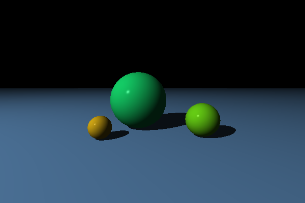

# The Ray Tracer Challenge

A C++23 ray tracer built by working through Jamis Buck's book
[*The Ray Tracer Challenge*](https://pragprog.com/titles/jbtracer/the-ray-tracer-challenge/)
(published by The Pragmatic Programmers). Each chapter's Gherkin scenarios live under
`tests/features/*.feature` and are implemented as Catch2 test cases.

**This is an ongoing project** — chapters are being worked through and
implemented incrementally, so features, architecture, and this README are
all still evolving.

## Requirements

- CMake 3.26+
- Ninja
- Clang with libc++

## Building

The project uses CMake presets:

```bash
# Debug
cmake --preset debug
cmake --build --preset debug

# Release
cmake --preset release
cmake --build --preset release
```

## Running

```bash
./build/release/raytracer
```

`main.cpp` currently runs `simulate_multiple_spheres()`, which renders a
scene (a plane floor and spheres, lit and shaded) to a `.ppm` file. Other
simulations from earlier chapters (a projectile, an analog clock face, a
flat-shaded sphere silhouette, a single lit sphere) are defined in
`raytracer/Simulation.cpp`/`Simulation.hpp` and can be swapped in from
`main()`.

Latest render:



## Testing

Tests use Catch2 and CTest:

```bash
ctest --preset debug
ctest --preset debug --output-on-failure

# Run a specific test by name
./build/debug/tests/tests "[Translation test]"

# Run tests matching a pattern
./build/debug/tests/tests "Rotation*"
```

## Architecture

All types live in the `raytracer` namespace.

- **`Point` / `Vector`** (`Point.hpp`, `Vector.hpp`) — 3D geometric
  primitives (`w=1` for points, `w=0` implicit for vectors).
- **`Matrix`** (`Matrix.hpp`, `MatrixImpl.hpp`) — owns its data directly (a
  private `std::vector<T>`) behind a custom multidimensional
  `operator[](row, col)`. Supports `multiply`, `transpose`, `inverse`,
  `translation`, `scale`, `rotation_*`, `shearing`.
- **`Shape`** (`Shape.hpp`) — common base (transform, material, id) shared
  by every concrete shape via a CRTP `ShapeFactory` mixin. Concrete shapes
  (`Sphere`, `Plane`, in `Intersect.hpp`) each implement their own
  `local_intersect`/`local_normal_at` in their own object space; the shared
  `intersect`/`normal_at` templates handle converting to and from object
  space. `AnyShape` (`std::variant<Sphere, Plane>`) is the single place a
  new shape type gets added, and is what `World::objects` and
  `Intersection::object` store.
- **`Ray` / `Intersection`** (`Intersect.hpp`, `Intersect.cpp`) — ray
  casting; `intersect()` returns the intersections with a shape, `hit()`
  picks the visible one.
- **`Material` / lighting** (`Material.hpp`, `Light.hpp`) — Phong shading.
- **`World` / `Camera`** (`World.hpp`, `Camera.hpp`) — a scene (objects +
  light) and the camera that casts rays through it.
- **`Colour` / `Canvas`** (`Colour.hpp`, `Canvas.hpp`) — RGB colour with
  Hadamard product; `Canvas` writes PPM output.

## License

This project's own code is licensed under
[CC BY-NC 4.0](https://creativecommons.org/licenses/by-nc/4.0/). The Gherkin
scenarios under `tests/features/*.feature` are adapted from the book itself
and carry a separate attribution notice — see [LICENSE](LICENSE) for both.
